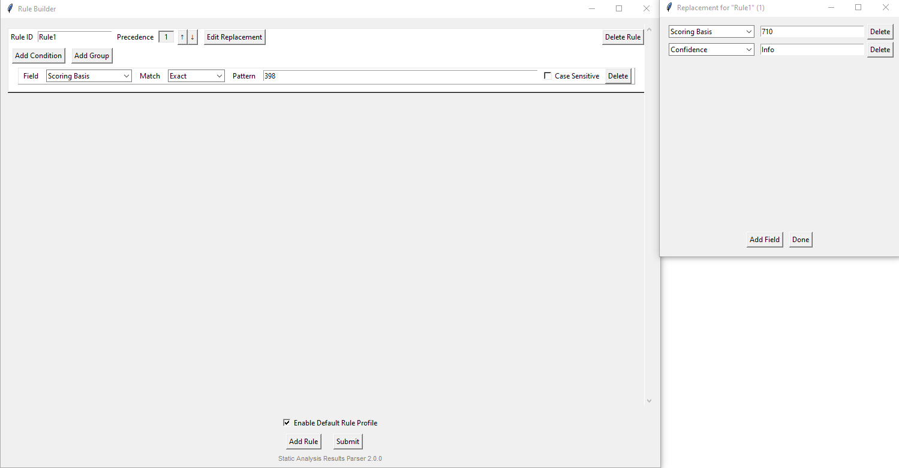
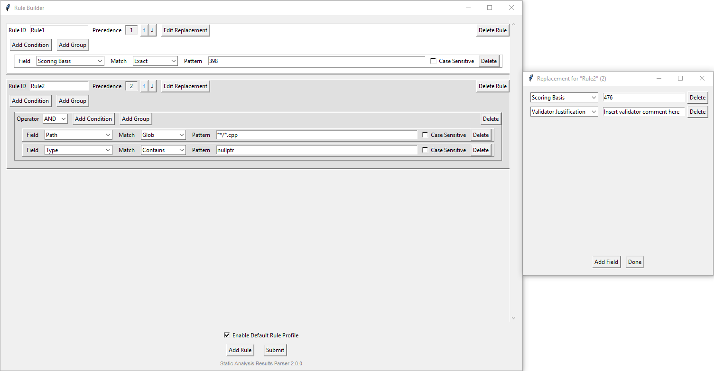
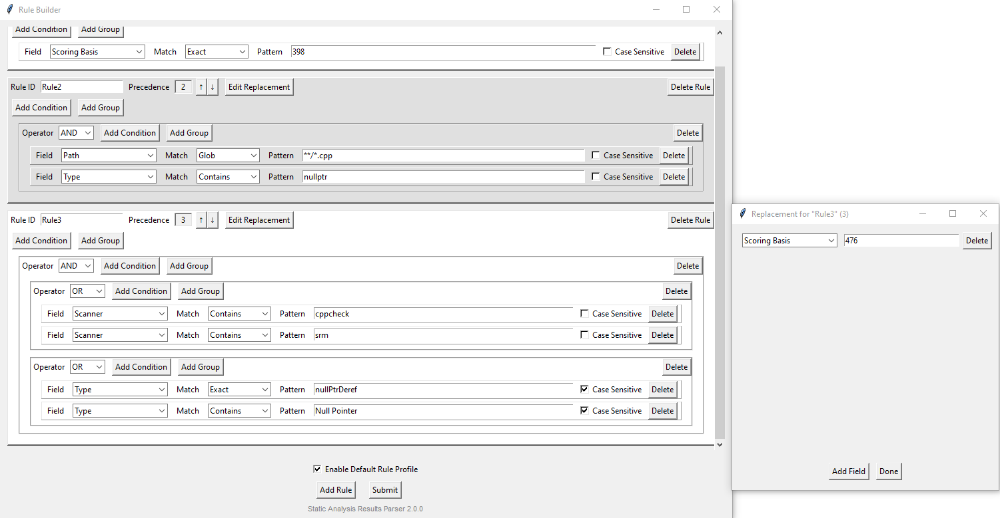

# Static Analysis Results Parser

## Description
Static Analysis Results Parser (SARP) will parse a set of output files from static analysis tools and collect them into one Excel, SARIF, or CSV file.

### Accepted Inputs
| Scanner                   | Results File Extension                                                           |
| ------------------------- | -------------------------------------------------------------------------------- |
| SARP                      | `.xlsx`, `.sarif`, `.csv`                                                        |
| SARIF                     | `.sarif`                                                                         |
| Checkmarx                 | `.xml`\*\*, `.csv`                                                               |
| CppCheck                  | `.xml`                                                                           |
| Coverity                  | `.json`                                                                          |
| OWASP Dependency Check    | `.json`, `.csv`                                                                  |
| ESLint                    | `.json`                                                                          |
| Fortify                   | `.fpr`                                                                           |
| Gnat SAS                  | `.sarif`\*\*, `.csv`                                                             |
| NVD CVE                   | `.csv` (See [Batch-NVD-CVE](https://github.com/DevinPatel72/Batch-NVD-Query))    |
| Pragmatic                 | `.csv`                                                                           |
| Pylint                    | `.json`                                                                          |
| Semgrep                   | `.json`\*\*, `.csv`                                                              |
| Sigasi                    | `.json`                                                                          |
| SRM                       | `.xml`\*\*, `.csv`                                                               |

\*\* This format is preferred because it provides the most complete set of information for parsing.

## Execute Using Executables

**Requirements:**
- Ensure the config folder is in the same directory as the executables.
- No external dependencies are required to execute the executables.


## Execute Using Interpreter

**Dependencies:**

Though not required, SARP does use external modules for certain features.

```bash
$ pip install -r requirements.txt
```

**Execution:**

```bash
$ python3 parse-cli.py
  --or--
$ python3 parse-gui.py
```


## Build Instructions

**Requirements:**

External modules `tkinter`, `openpyxl`, `matplotlib`, and `pyinstaller` must be installed.

```bash
$ pip install pyinstaller openpyxl matplotlib
```

`tkinter` must be installed system-wide. Methods vary for [Windows](https://www.pythonguis.com/installation/install-tkinter-windows/) and [Linux](https://www.pythonguis.com/installation/install-tkinter-linux/).

Then execute the build script.


## Command Line Options

| Inputs                                                                             | Description                                                                                                                                                                                                                       |
| ---------------------------------------------------------------------------------- | --------------------------------------------------------------------------------------------------------------------------------------------------------------------------------------------------------------------------------- |
| `-pn`<br>`--project-name PROJECTNAME`                                              | Specify the project name to include in generated reports.                                                                                                                                                                         |
| `-pv`<br>`--project-version PROJECTVERSION`                                        | Specify the project version to include in generated reports.                                                                                                                                                                      |
| `-i`<br>`--input SCANNER FILE`                                                     | Add a scanner input using a scanner name and a path to the corresponding results file. Can be specified multiple times. Used in addition to a `--file` input if present.                                                          |
| `-I`<br>`--extended-input SCANNER FILE REMOVE PREPEND`                             | Add a scanner input with path transformation settings. Accepts scanner name, file path, path prefix to remove, and path prefix to prepend. Can be specified multiple times. Used in addition to a `--file` input if present.      |
| `-f`<br>`--file FILE`                                                              | Load an inputs JSON configuration file. Accepts either an absolute path or a filename located in the `config/inputs` directory. Defaults to `config/inputs/sarp_inputs.json` if no input options are specified.                   |
| `-o`<br>`--out OUT`                                                                | Output file path. Overrides the output path specified in a `--file` input. If not specified, the current working directory is used.                                                                                               |

| Control Flags                                                                      | Description                                                                                                                                                                                                                       |
| ---------------------------------------------------------------------------------- | --------------------------------------------------------------------------------------------------------------------------------------------------------------------------------------------------------------------------------- |
| `--no-category-mappings`                                                           | Disable Category Mappings. Overrides the flag value specified in a `--file` input.                                                                                                                                                |
| `--no-preflight-rules`                                                             | Disable all Preflight Rules. Overrides the flag value specified in a `--file` input.                                                                                                                                              |
| `--no-default-preflight-rules`                                                     | Disable the built-in Default Preflight Rules. Overrides the flag value specified in a `--file` input.                                                                                                                             |
| `--duplicate-scanner-consolidation`                                                | Enable Duplicate Scanner Consolidation. Overrides the flag value specified in a `--file` input.                                                                                                                                   |
| `--sarif-stitch-properties`                                                        | By default, SARIF format will output without STITCH properties such as Confidence, Exploit Maturity, Environmental Metrics, etc. To include these properties, pass this option.                                                   |

| Options                                                                            | Description                                                                                                                                                                                                                       |
| ---------------------------------------------------------------------------------- | --------------------------------------------------------------------------------------------------------------------------------------------------------------------------------------------------------------------------------- |
| `-h`<br>`--help`                                                                   | Display help information and exit.                                                                                                                                                                                                |
| `-v`<br>`--version`                                                                | Print the software version and exit.                                                                                                                                                                                              |
| `-c`<br>`--check-inputs`                                                           | Validate the inputs JSON file specified by `--file`, report any errors, and exit.                                                                                                                                                 |
| `-l`<br>`--list-inputs [CONFIG_FILE]`                                              | List available input config files in the `config/inputs` directory. If `CONFIG_FILE` (file name or path) is provided, display that file's contents.                                                                               |
| `-s`<br>`--save-config [SAVE_NAME]`                                                | Save the current command line inputs to a configuration file. If `SAVE_NAME` is provided, save to the `config/inputs` directory using that name. If not, overwrite the file specified by `--file` or create a new config file.    |
| `--format [FORMAT]`                                                                | Format of output file. `FORMAT` can be EXCEL, SARIF, or CSV.                                                                                                                                                                      |
| `--example-template`                                                               | Print an example inputs JSON template and exit.                                                                                                                                                                                   |
| `--disable-progressbar`                                                            | Disables progress bar for faster performance.                                                                                                                                                                                     |

## Input Configuration File
A JSON configuration file can be created to store and pass SARP inputs.
A template can be obtained by passing the `--example-template` switch in the command line.
Any inputs passed via command line can be saved with the `--save-config` option.
Note that any input configurations in a file that are identical will be pruned to one unique config entry.
This config file is auto-generated whenever the SARP GUI begins parsing. 
Note that if any loaded data is changed in the GUI, that input file will be overwritten with the new data.

## Configure CWE Mappings
SARP allows configurable CWE mappings for scanners that do not output CWE data. A basic set of mappings are provided, but users are able to edit them in the `config/mappings` directory.

## Configure Preflight
SARP can perform user-defined overrides on any of the output fields using rule expressions and extended matching techniques.

### Match Patterns
Each rule contains a condition that attempts to match a Fieldname value to a user-defined pattern. If a match is found, the condition is resolved to true.

Patterns can be matched according to the following techniques:
- Exact (Will be case insensitive unless optioned otherwise)
- Contains
- StartsWith
- EndsWith
- Glob (Path Globbing, e.g. src/*\*/\*.cpp)
- Regular Expression

### Chaining Condition Expressions
Each rule can contain condition groups that apply a boolean operator to each of the conditions within the group.
- AND (All conditions in the group must evaluate to True)
- OR (At least one condition in the group must evaluate to True)
- NOT (Only the first condition is negated. ***All others are ignored.***)

A condition group can contain another condition group to create nested boolean expressions. Note that every condition group must contain at least one condition.

### Rule Ordering
A precedence ordering can be applied to each rule. The rules will be applied from least to greatest, so subsequent rules will overwrite any overrides done in preceding rules.

### Examples
#### Example 1


The above `Rule1` looks for an exact match for the value in field `Scoring Basis` (e.g., a CWE or CVE ID) and replaces the `Scoring Basis` with *710* and `Confidence` with *Info*.

Expression: `Scoring Basis == 398`

#### Example 2


The above `Rule2` looks for any finding that is in a `.cpp` file **AND** contains *nullptr* in the `Type` column. The `Scoring Basis` is replaced with *476* and the `Validator Justification` is replaced with *Insert validator comment here*.

Expression: `(Path glob "**/*.cpp") && ("nullptr" in Type)`

#### Example 3


The above `Rule3` looks for any finding that originates from either CPPCheck **OR** SRM, **AND** it is either of `Type` *nullPtrDeref* **OR** contains *Null Pointer*. The `Scoring Basis` is replaced with *476*.

Expression: `("cppcheck" in Scanner || "srm" in Scanner) && (Type == "nullPtrDeref" || "Null Pointer" in Type)`
